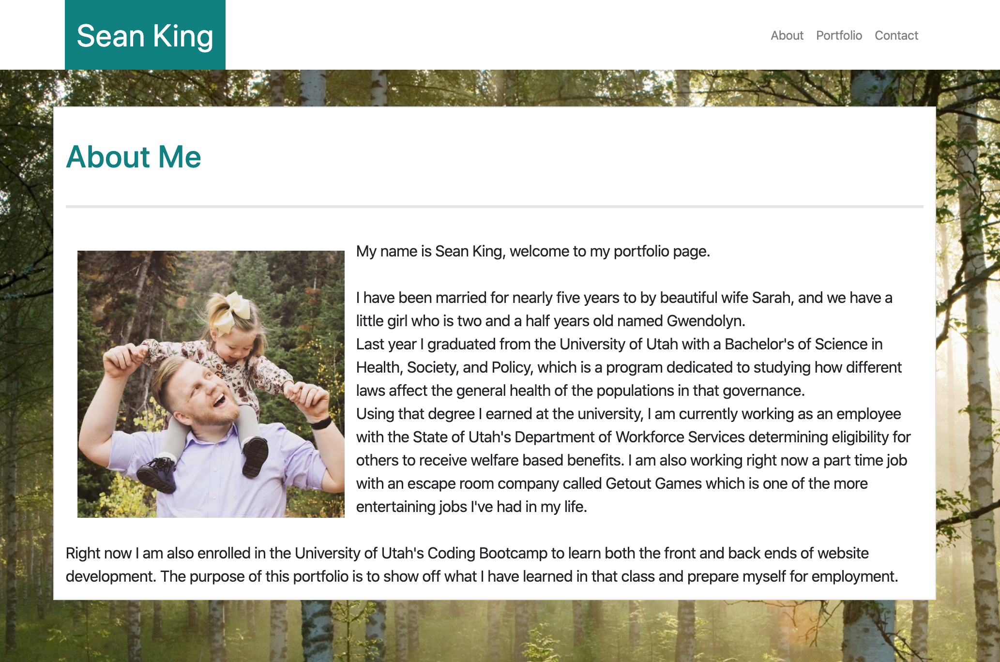
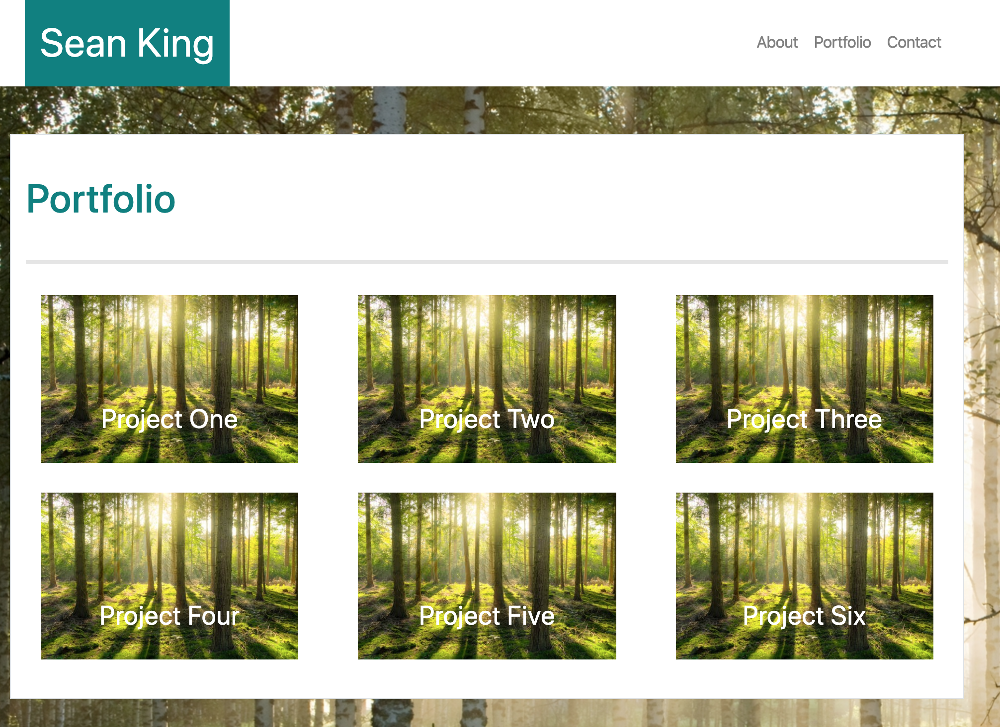
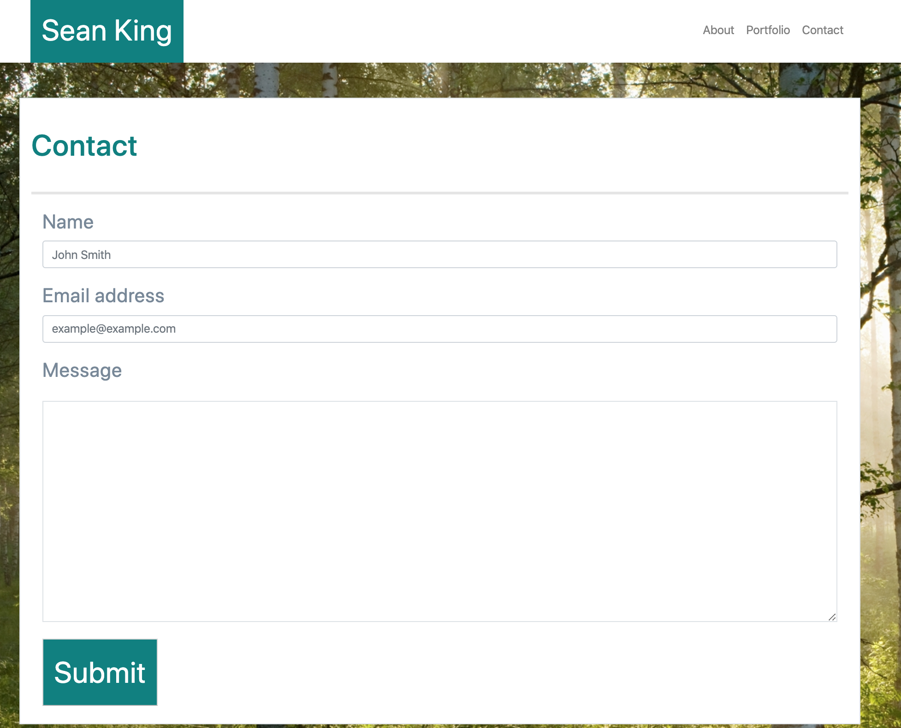

# This is Sean King's responsive portfolio for Homework Two
You will find the portfolio [here](https://seanianking.github.io/Responsive-Portfolio/index.html)

The purpose of the portfolio is to exhibit the work done throughout the University of Utah coding bootcamp program, and will be extended to include professional work after the program is finished.

## Contents

The index page includes the *About Me* section describing myself.

At the top right of that page you will find links to the *Portfolio* and *Contact* pages. As the projects are completed for the portfolio, the images will be replaced to show something more relevant and the titles of the projects will be included rather than the current "project one, project two etc." placeholders

A screenshot of the portfolio page:

a screenshot of the contact page:

## Credits

A lot of help and inspiration came from the following resources:

* https://getbootstrap.com/docs/4.0/getting-started/introduction/
* https://www.w3schools.com/
* https://github.com/SpencerBangerter
* https://guides.github.com/features/mastering-markdown/
* https://github.com/microsoft/vscode

### License

Licensed under the [MIT](LICENSE.txt) license.